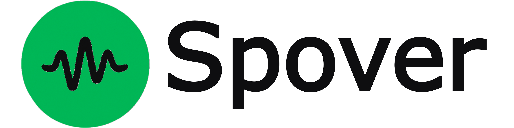

  

# Spover - https://spover.fatiihnaz.com 
*A modern, hack-free Spotify® overlay for Windows & macOS, built with Electron and React 19.*

  

---

## Features
* **Always-on-top overlay** that shows information about your current playing song, playlist and next song.  
* **Media controls** (play/pause, next/previous) and real-time BPM / progress info via Spotify Web API.  
* **Keyboard shortcuts** that are fully re-bindable.  
* **Theme aware**: Spover extracts album-art colours with `node-vibrant` and auto-generates gradients.
* **User Friendly**: Spover allows user to configure the overlay settings via a user friendly UI.  
* **Framer-motion animations** & Tailwind utility classes for smooth UX.  

> **Heads-up:** Spover **does not** bypass Spotify™ ads or require the client to be modified.  
> You still need a Premium or open Spotify session for full functionality.

---

## Quick start

~~~bash
# 1. Clone and install
git clone https://github.com/fatiihnaz/spover.git
cd spover
npm install        # or pnpm / yarn

# 2. Dev mode (hot-reload React & Electron)
npm run dev

# 3. Production build
npm run dist:win   # Windows installer & zip
npm run dist:mac   # macOS universal .dmg & zip
npm run dist       # platform autodetect
~~~

### Environment variables

Create a `.env` in the project root (never commit it) and provide **Spotify** credentials:

~~~dotenv
SPOTIFY_CLIENT_ID=your_id
SPOTIFY_CLIENT_SECRET=your_secret
SPOTIFY_REDIRECT_URI=http://localhost:xxxx/callback   # must match your dashboard
~~~

---

## Project structure

~~~text
spover/
├── public/                   # Static assets (icons, images, etc.)
│   ├── spover.ico | .icns
│
├── src/                      # Application source code
│   ├── bootstrap.js          # Electron main‑process bootstrap (bundled to build/main.js)
│   ├── build‑main.js         # Esbuild script for bundling bootstrap.js
│   │
│   ├── core/                 # Electron core modules
│   │   ├── authServer.js     # OAuth callback server
│   │   ├── protocol.js       # PKCE + OAuth URL construction & handling
│   │   ├── windows.js        # BrowserWindow and overlay setup
│   │   └── tray.js           # System tray icon & menu
│   │
│   ├── preload/              # Preload scripts for renderer security
│   │   └── index.js          # Exposes IPC APIs to the renderer
│   │
│   ├── services/             # Business‑logic services
│   │   ├── settings.js       # Persistent settings (electron‑store)
│   │   ├── credentials.js    # Secure token storage
│   │   ├── shortcuts.js      # Shortcut saving
│   │   └── spotify.js        # Spotify Web API integration & polling
│   │
│   ├── hooks/                # Reusable React/Electron hooks  
│   │   ├── useConfig.js              # Read/write app configuration  
│   │   ├── useOverlayControl.js      # Control overlay visibility/modes  
│   │   ├── useOverlayDrag.js         # Handle drag events on overlay  
│   │   ├── useOverlayModes.js        # Manage multiple overlay modes  
│   │   ├── useOverlayMouseTracking.js# Track mouse movements over overlay  
│   │   ├── useOverlayReactiveColor.js# Dynamically update overlay colors  
│   │   ├── useOverlaySpotifyData.js  # Fetch & expose Spotify playback data  
│   │   └── useShortcutCapture.js     # Listen for global keyboard shortcuts  
│   │
│   ├── renderer/              # Front‑end (React + Tailwind)
│   │
│   └── utils/
│       └── shortcutGuard.js  # Security handling for shortcut registiration 
│
├── index.html                # Vite entry point for renderer
├── package.json              # Project metadata, scripts & dependencies
├── package-lock.json         # Exact dependency versions
├── vite.config.mjs           # Vite configuration (React + Tailwind)
├── .gitignore                # Ignored files & directories
└── LICENSE                   # CC BY‑NC 4.0 license text
~~~

---

## Scripts (excerpt)

| Script              | What it does                                                        |
|---------------------|---------------------------------------------------------------------|
| `npm run dev`       | Concurrently watches `src/` and runs Vite + Electron in dev mode.   |
| `npm run build`     | Builds renderer + main in `build/` without packaging.               |
| `npm run dist:win`  | Code-signs & creates NSIS installer and ZIP for Windows x64.        |
| `npm run dist:mac`  | Builds signed universal `.dmg` & ZIP for macOS (x64 + arm64).       |

---

## Contributing

1. Fork → feature branch (`feat/thing`)  
2. `npm run dev` and make sure `npm run test` passes (tests TBD)  
3. Submit a PR – describe _what_ & _why_, link issues if any.

All contributions are accepted under the same **CC BY-NC 4.0** licence.

---

## Licence

> **Creative Commons Attribution-NonCommercial 4.0 International**  
> © 2025 Fatih Naz – see [`LICENSE`](LICENSE) for full terms.  
> Commercial use **is not permitted**. No patent or trademark rights are granted.  
> Software is provided **“as-is”** without any warranty.

---

## More Information

More information about the app can be found at: https://spover.fatiihnaz.com
